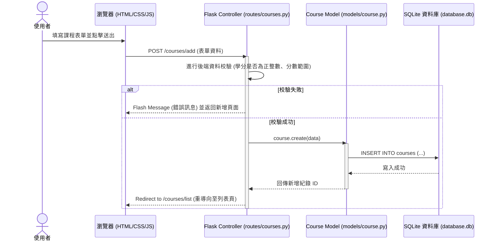
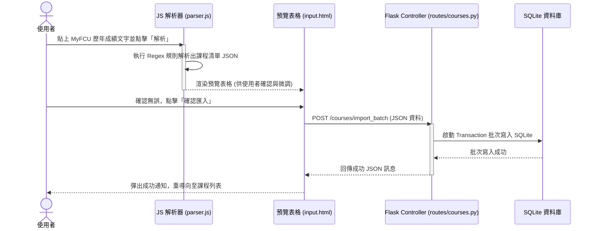

# 逢甲大學學業進度與時間管理整合系統 - 系統架構文件 (ARCHITECTURE)

本文件描述此系統的軟體架構、專案資料夾結構與元件之間的資料流向。

## 1. 技術架構說明

本專案使用 Python + Flask 框架，並採用經典的 **MVC (Model-View-Controller)** 設計模式進行網頁開發，不採用前後端分離，頁面直接由 Flask + Jinja2 模板引擎混合渲染：

* **Model (模型層)**：
  - 位於 `app/models/` 資料夾中。
  - 負責直接與 SQLite 資料庫進行互動（使用原生 `sqlite3`）。
  - 提供 `course.py` 來進行對 `courses` 資料表的 CRUD（建立、讀取、更新、刪除）操作，並包含批次寫入之交易管理（Transaction Control）。
* **View (視圖層)**：
  - 位於 `app/templates/` 與 `app/static/` 資料夾中。
  - 使用 HTML5 與 Jinja2 模板動態渲染網頁，靜態資源包含客製化的 CSS 及 JS，提供前台的互動機制。
* **Controller (控制器/路由層)**：
  - 位於 `app/routes/` 資料夾中。
  - 使用 Flask 的 `Blueprint` 功能將不同負責人的模組解耦。
  - 接收來自使用者的 HTTP 請求（GET/POST），驗證請求參數後，呼叫對應的 Model 處理資料，最後傳遞資料至 View 進行頁面渲染，或重導向（Redirect）至指定頁面。

---

## 2. 專案資料夾結構

本專案結構如下：

```text
FCU.student.point/
├── app/
│   ├── __init__.py         # 初始化 Flask App、註冊 Blueprint、註冊資料庫關閉鉤子
│   ├── models/
│   │   ├── __init__.py
│   │   ├── db.py           # SQLite 連線與資料庫初始化 (init_db)
│   │   ├── schema.sql      # SQLite 建表語法
│   │   └── course.py       # 課程資料庫模型與業務邏輯 (CRUD)
│   ├── routes/
│   │   ├── __init__.py
│   │   ├── main.py         # 主要頁面路由（Dashboard 首頁）
│   │   └── courses.py      # 學分分類錄入 (F-01) 路由（新增、修改、刪除、批次匯入）
│   ├── static/
│   │   ├── css/
│   │   │   └── style.css   # 全站共用 CSS（深色系、磨砂玻璃質感、響應式）
│   │   └── js/
│   │       ├── main.js     # Toast 訊息提示與通用 UI 邏輯
│   │       └── parser.js   # 歷年成績文字解析器與 CSV 解析器邏輯
│   └── templates/
│       ├── base.html       # 全站共用母模板（頂部導覽列、側邊選單、彈出 Toast 區）
│       ├── index.html      # 儀表板首頁 (View)
│       └── courses/
│           ├── input.html  # 手動與批次錄入表單頁 (View)
│           └── list.html   # 課程清單、查詢與編輯頁 (View)
├── instance/
│   └── database.db         # SQLite 本機資料庫（自動產生，不納入 Git）
├── docs/
│   ├── PRD.md              # 產品需求文件
│   └── ARCHITECTURE.md     # 系統架構文件
├── app.py                  # 應用程式啟動入口
├── requirements.txt        # Python 依賴包列表
└── README.md
```

---

## 3. 元件關係與資料流 (Mermaid)

### 3.1 頁面渲染與資料儲存流程



### 3.2 歷年成績貼上解析與批次匯入流程



---

## 4. 關鍵設計決策

1. **SQLite 與 LocalStorage 雙軌備份**：
   由於專題規範需要後端 Flask 路由，因此以 SQLite 作為主要儲存。但為了兼顧「隱私保護，不強制存伺服器」的非功能性需求，系統於 `parser.js` 中支援將資料庫內容匯出為 JSON 並存於 LocalStorage，並提供「匯出備份」與「匯入還原」功能，讓學生擁有資料完全掌控權。
2. **正則表達式 (Regex) 解析 MyFCU 成績文字**：
   學生從 MyFCU 複製的成績格式通常是由 Tab 鍵或空格分隔的文字行。我們在前端 `parser.js` 中實作一個正則解析引擎，自動過濾無效行並抓取「學期、課程名稱、學分、成績、選別（類別）」等特徵，最大程度優化錄入體驗。
3. **前端預覽後端寫入的「兩階段批次匯入」**：
   為了避免 CSV 欄位錯位或文字解析錯誤導致髒資料直接寫入資料庫，解析器會先在前端渲染「待匯入預覽表」，使用者確認（並能手動修改其中個別欄位）後，再點擊確認，一次性發送 Ajax POST 請求給後端寫入。
4. **Flask Blueprint 模組解耦**：
   將 `courses` 獨立為 Blueprint，讓與其他組員開發的 `F-02` (門檻設定)、`F-03` (試算引擎) 整合時，只需在 `app/__init__.py` 中註冊新的 Blueprint 即可，避免程式碼衝突。
