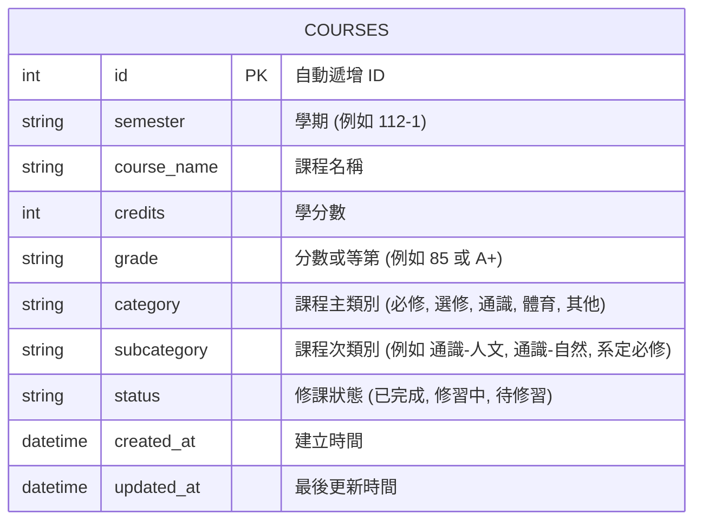

# 逢甲大學學業進度與時間管理整合系統 - 資料庫設計文件 (DB_DESIGN)

本文件定義系統中用以儲存課程與學分資料的 SQLite 資料表結構與關係。

## 1. 實體關係圖 (ERD - Mermaid)

目前本模組主要維護單張核心資料表 `courses`，用以儲存學生所有修課紀錄。



---

## 2. 資料表欄位詳細說明

### 2.1 `courses` 資料表

用以記錄使用者手動輸入或批次匯入的每一門課程。

| 欄位名稱 | 資料型別 | 屬性限制 | 預設值 | 說明 |
| :--- | :--- | :--- | :--- | :--- |
| `id` | INTEGER | PRIMARY KEY AUTOINCREMENT | — | 自動遞增的主鍵 ID |
| `semester` | TEXT | NOT NULL | — | 學期，格式如 `112-1`、`112-2` |
| `course_name` | TEXT | NOT NULL | — | 課程中文或英文名稱 |
| `credits` | INTEGER | NOT NULL | — | 學分數，必須大於 0 |
| `grade` | TEXT | NULLABLE | NULL | 分數/等第。可為百分制分數 (0-100)、等級制 (A+, B, C) 或抵免等文字。若為「修習中」或「待修習」則通常為空值或空字串 |
| `category` | TEXT | NOT NULL | — | 課程類別：`必修`、`選修`、`通識`、`體育`、`其他` |
| `subcategory` | TEXT | NULLABLE | '' | 次類別：如通識的細分領域（人文、自然、社會、綜合、核心）或各系自訂次類別 |
| `status` | TEXT | NOT NULL | '已完成' | 修課狀態：`已完成`（已取得成績）、`修習中`（這學期正在修）、`待修習`（未來規劃要修） |
| `created_at` | DATETIME | NOT NULL | CURRENT_TIMESTAMP | 紀錄建立的時間 |
| `updated_at` | DATETIME | NOT NULL | CURRENT_TIMESTAMP | 紀錄最後更新的時間 |

---

## 3. SQL 建表語法

建表語法儲存於 [schema.sql](file:///c:/Users/user/OneDrive/桌面/FCU.student.point/FCU.student.point/app/models/schema.sql)：

```sql
-- 建立 courses 資料表
CREATE TABLE IF NOT EXISTS courses (
    id INTEGER PRIMARY KEY AUTOINCREMENT,
    semester TEXT NOT NULL,
    course_name TEXT NOT NULL,
    credits INTEGER NOT NULL CHECK (credits > 0),
    grade TEXT,
    category TEXT NOT NULL CHECK (category IN ('必修', '選修', '通識', '體育', '其他')),
    subcategory TEXT DEFAULT '',
    status TEXT NOT NULL DEFAULT '已完成' CHECK (status IN ('已完成', '修習中', '待修習')),
    created_at DATETIME DEFAULT CURRENT_TIMESTAMP,
    updated_at DATETIME DEFAULT CURRENT_TIMESTAMP
);

-- 建立索引以加速搜尋與篩選
CREATE INDEX IF NOT EXISTS idx_courses_semester ON courses(semester);
CREATE INDEX IF NOT EXISTS idx_courses_category ON courses(category);
```

---

## 4. Python Model CRUD 骨架設計

我們將在 `app/models/course.py` 中定義資料存取方法：

```python
import sqlite3

def get_db_connection():
    # 建立與 SQLite 的連線，設定 row_factory 讓回傳值可以 dict 存取
    pass

class Course:
    @staticmethod
    def create(data):
        """新增單筆課程"""
        pass
        
    @staticmethod
    def get_all(filters=None):
        """取得所有課程，支援依學期、類別、狀態進行篩選"""
        pass
        
    @staticmethod
    def get_by_id(course_id):
        """根據 ID 取得單筆課程"""
        pass
        
    @staticmethod
    def update(course_id, data):
        """更新單筆課程"""
        pass
        
    @staticmethod
    def delete(course_id):
        """刪除單筆課程"""
        pass
        
    @staticmethod
    def import_batch(courses_list):
        """批次寫入課程，使用資料庫 Transaction 確保一致性"""
        pass
```
