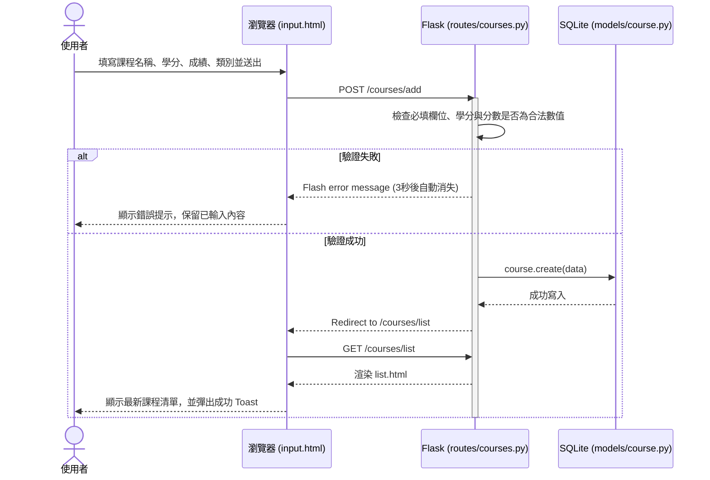
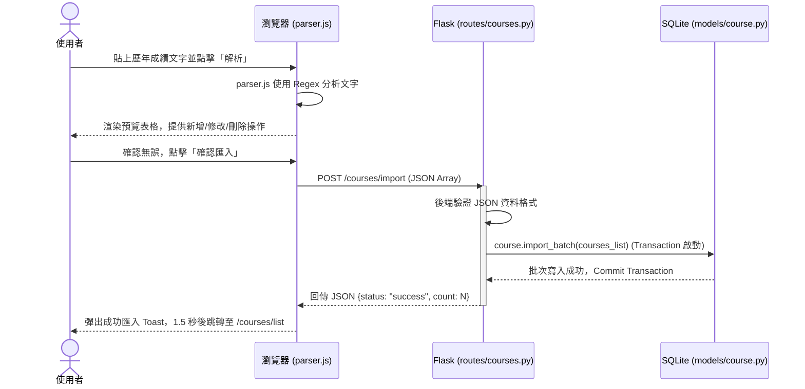

# 逢甲大學學業進度與時間管理整合系統 - 流程圖與路由對照文件 (FLOWCHART)

本文件使用 Mermaid 語法展示系統的使用者操作流程、資料流動序列，以及功能與 URL 路由的對照關係。

## 1. 使用者流程圖 (User Flow)

這個流程圖展示學生進入網站後，如何進行學分分類錄入與管理的各項操作：

```mermaid
flowchart TD
  Start([使用者進入網站]) --> Dash[首頁儀表板]
  Dash --> Nav{選擇操作}

  %% 學分錄入分支
  Nav -->|手動錄入 / 批次匯入| InputPage[學分錄入頁面 - input.html]
  InputPage --> InputType{選擇錄入方式}
  InputType -->|手動填寫表單| ManualForm[輸入課程、學分、成績、類別]
  ManualForm --> SubmitManual[點擊送出]
  SubmitManual --> ValidateForm{後端資料驗證}
  ValidateForm -->|失敗: 欄位錯誤| ManualForm
  ValidateForm -->|成功| DBInsert[寫入 SQLite 資料庫]

  InputType -->|拖曳上傳 CSV| CSVUpload[讀取 CSV 檔案]
  InputType -->|貼上 MyFCU 成績| PasteText[貼上學期成績文字]
  CSVUpload --> ParsePreview[前端解析並顯示預覽表格]
  PasteText --> ParsePreview
  ParsePreview --> PreviewConfirm{確認資料正確？}
  PreviewConfirm -->|不正確| EditPreview[在預覽表格中直接修改]
  EditPreview --> ParsePreview
  PreviewConfirm -->|正確| AJAXSubmit[點擊「確認匯入」送出 AJAX]
  AJAXSubmit --> DBInsertBatch[批次寫入 SQLite 資料庫]

  %% 課程列表與管理分支
  Nav -->|檢視課程列表| ListPage[課程清單頁面 - list.html]
  ListPage --> FilterSearch[輸入關鍵字搜尋 或 依類別/學期篩選]
  FilterSearch --> ViewList[檢視過濾後的課程列表]
  ViewList --> CourseAction{要管理課程嗎？}
  CourseAction -->|刪除課程| DeletePost[點擊刪除按鈕 (POST)]
  DeletePost --> DBDelete[從資料庫移除]
  CourseAction -->|編輯課程| EditForm[彈出編輯模態視窗 或 表單]
  EditForm --> SubmitEdit[送出修改 (POST)]
  SubmitEdit --> DBUpdate[更新資料庫紀錄]

  %% 結束狀態
  DBInsert --> ListPage
  DBInsertBatch --> ListPage
  DBDelete --> ListPage
  DBUpdate --> ListPage
```

---

## 2. 系統序列圖 (Sequence Diagram)

### 2.1 手動新增課程

描述使用者在前端填寫課程，並送出儲存的後台交互過程：



### 2.2 批次匯入（文字解析與 AJAX 寫入）



---

## 3. 功能清單與路由對照表

以下為 F-01 模組中，所有頁面與 API 的對照關係：

| 功能名稱 | HTTP 方法 | URL 路徑 | 對應 HTML 模板 | 說明 |
| :--- | :--- | :--- | :--- | :--- |
| **儀表板首頁** | GET | `/` | `index.html` | 顯示已修總學分與進度儀表板 (mock 串接) |
| **錄入頁面** | GET | `/courses/input` | `courses/input.html` | 手動新增表單與 CSV/文字解析匯入介面 |
| **手動新增** | POST | `/courses/add` | — | 接收新增表單，驗證後寫入 DB，重導向 |
| **課程列表** | GET | `/courses/list` | `courses/list.html` | 顯示所有課程、支援類別篩選與關鍵字搜尋 |
| **編輯頁面** | GET | `/courses/<id>/edit` | `courses/edit.html` *(或 Modal)* | 顯示該筆課程的編輯表單頁面 |
| **更新課程** | POST | `/courses/<id>/update` | — | 接收編輯表單，更新 DB，重導向 |
| **刪除課程** | POST | `/courses/<id>/delete` | — | 刪除指定 ID 課程，重導向 |
| **批次匯入 API** | POST | `/api/courses/import` | — | 接收前端解析後的 JSON Array，批次寫入 DB |
| **備份還原 API** | GET | `/api/courses/export` | — | 匯出目前所有的課程為 JSON，供 LocalStorage 下載備份 |
